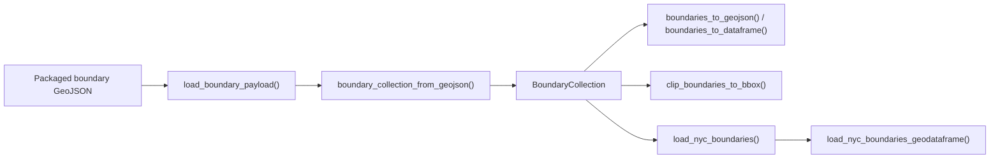
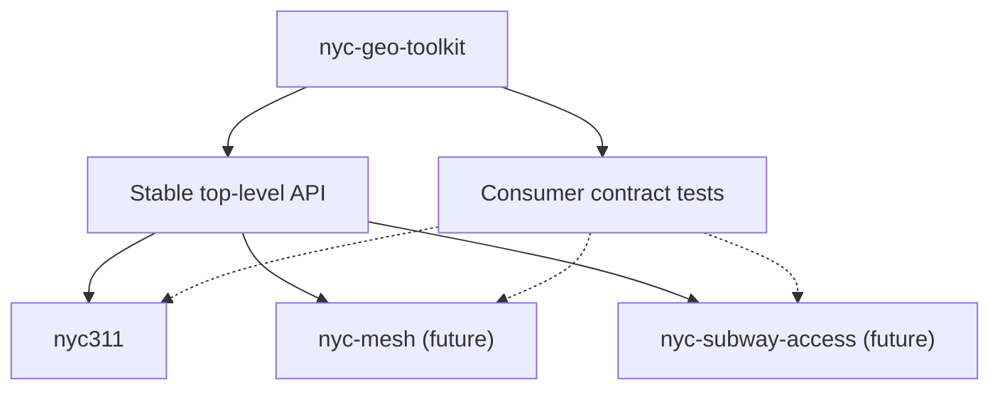

# Architecture

`nyc-geo-toolkit` is a small data-first package. Its job is to ship canonical
NYC boundary assets and expose a stable top-level API for loading,
normalizing, converting, and subsetting them.

## Design goals

- keep the public surface small and explicit
- ship packaged GeoJSON data with no runtime network dependency
- keep pandas, geopandas, and shapely behind optional extras
- support downstream NYC packages without embedding consumer-specific adapters
  in the toolkit

## Runtime flow

The loaders always return typed `BoundaryCollection` objects first. Optional
helpers then project those typed models into GeoJSON, pandas, GeoPandas, or
clipped geometry outputs.

## Public contract

The stable import surface is the top-level `nyc_geo_toolkit` namespace. The
package-level `__all__` in `src/nyc_geo_toolkit/__init__.py` is the contract
that downstream packages should rely on.

Underscore-prefixed modules such as `_loaders.py`, `_normalize.py`, and
`_resources.py` keep the implementation organized, but they are not public
compatibility promises.

## Ecosystem pattern

`nyc311` is the first consumer of this package, and future packages such as
`nyc-mesh` or `nyc-subway-access` can follow the same pattern: depend on the
shared toolkit surface, then add project-specific helpers in the consumer repo.

That design keeps responsibilities clear:

- `nyc-geo-toolkit` owns packaged boundary data, normalization rules, typed
  models, and the stable public contract
- consumer packages own their own compatibility shims and domain-specific logic
- if a consumer needs a reusable primitive, promote that primitive into the
  toolkit and document it there instead of adding a consumer-specific adapter
  directory in the toolkit

## Internal module map

For contributors, the internal layout is intentionally simple:

- `nyc_geo_toolkit.__init__` for the stable public namespace
- `nyc_geo_toolkit._catalog` for layer metadata
- `nyc_geo_toolkit._models` for typed boundary models
- `nyc_geo_toolkit._normalize` for layer and value normalization
- `nyc_geo_toolkit._resources` for packaged data access
- `nyc_geo_toolkit._geojson` for parsing GeoJSON into typed models
- `nyc_geo_toolkit._loaders` for boundary loading and optional GeoDataFrame
  helpers
- `nyc_geo_toolkit._conversions` for GeoJSON and DataFrame conversion helpers
- `nyc_geo_toolkit._ops` for generic clipping operations
