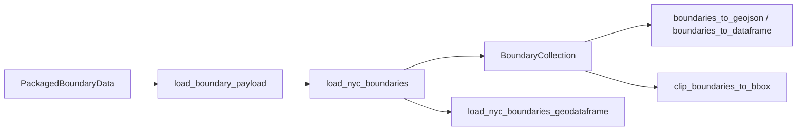

# Architecture

`nyc-geo-toolkit` is structured as a small data-first package.

## Flow

## Modules

- `nyc_geo_toolkit._catalog` for layer metadata
- `nyc_geo_toolkit._normalize` for layer and value normalization
- `nyc_geo_toolkit._resources` for packaged data access
- `nyc_geo_toolkit._geojson` for parsing GeoJSON into typed models
- `nyc_geo_toolkit._loaders` for boundary loading and optional GeoDataFrame
  helpers
- `nyc_geo_toolkit._conversions` for GeoJSON and DataFrame conversion helpers
- `nyc_geo_toolkit._ops` for generic clipping operations
