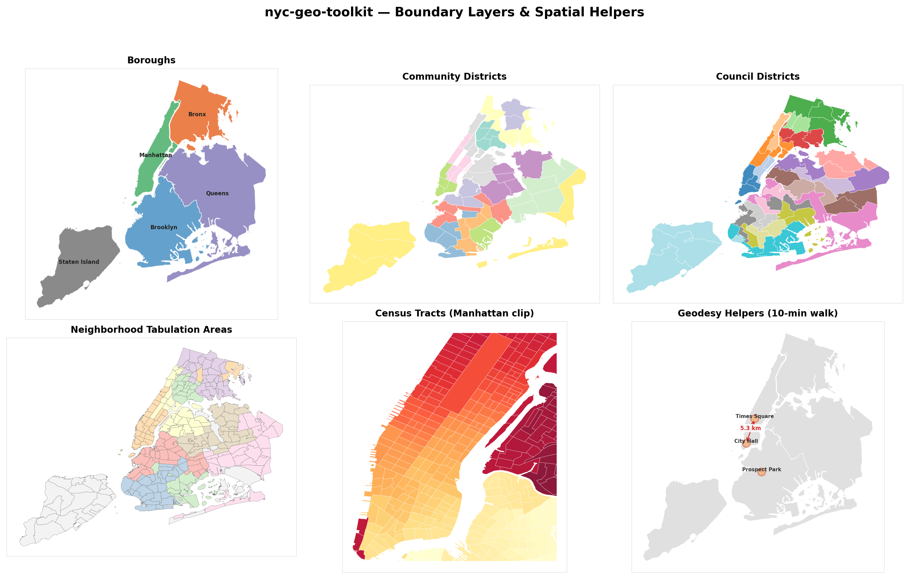

# nyc-geo-toolkit



`nyc-geo-toolkit` is a reusable core package for canonical NYC boundary data,
normalization helpers, and typed boundary-loading primitives.

Every NYC data project needs borough boundaries, ZIP lookups, and district
normalization. This package ships canonical boundary GeoJSON and a stable Python
API so downstream tools don't duplicate that work.

Authored by [Blaise Albis-Burdige](https://blaiseab.com/).

## What this package provides

- **Packaged boundary layers** for boroughs, community districts, council
    districts, NTAs, ZCTAs, and census tracts -- no runtime network dependency
- **Normalization helpers** that turn messy user input into canonical values
- **Geodesy helpers** for great-circle distance, walk-radius circles, and
    bounding boxes -- dependency-free
- **Typed boundary models** for safe, inspectable boundary data
- **GeoJSON, DataFrame, and GeoDataFrame conversion** with optional extras
- **Basemap and spatial helpers** for Web Mercator reprojection, OSM tile
    overlays, and bbox clipping

## Install

```bash
pip install nyc-geo-toolkit
```

Optional helpers:

```bash
pip install "nyc-geo-toolkit[dataframes]"
pip install "nyc-geo-toolkit[spatial]"
pip install "nyc-geo-toolkit[all]"
```

## Quickstart

```python
from nyc_geo_toolkit import list_boundary_layers, load_nyc_boundaries

print(list_boundary_layers())
queens = load_nyc_boundaries("borough", values="Queens")
print(queens.features[0].geography_value)
```

## Ecosystem

`nyc-geo-toolkit` is the shared geography core for a family of NYC data
packages:

| Package                                                          | Description                                  |
| ---------------------------------------------------------------- | -------------------------------------------- |
| [`nyc311`](https://github.com/random-walks/nyc311)               | 311 service request analysis and aggregation |
| [`subway-access`](https://github.com/random-walks/subway-access) | Subway accessibility and coverage analysis   |
| [`nyc-mesh`](https://github.com/random-walks/nyc-mesh)           | Community mesh network coverage analysis     |

All three depend on the stable `nyc_geo_toolkit` namespace for boundary data,
normalization, and spatial primitives. See [Architecture](architecture.md) for
how the ecosystem fits together.
